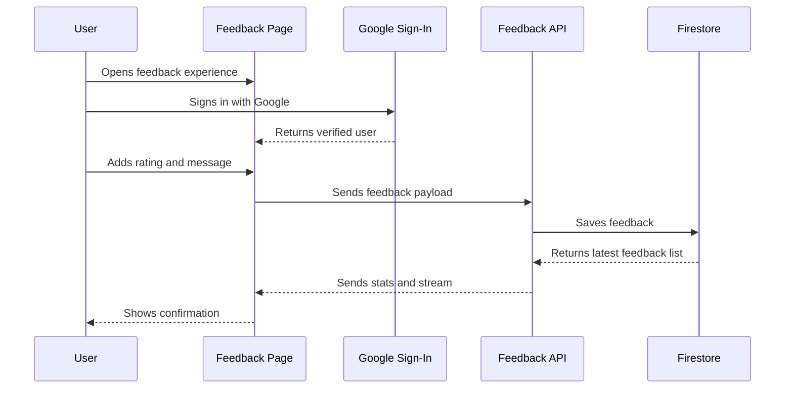

 

&nbsp;

&nbsp;

  

  

---

### Quick Navigation

---

## Overview

**Fun Particle Feedback** is the presentation and feedback hub for **Fun Particle**, an interactive browser experience where particle gravity responds to hand gestures, music, and game-like modes.

The feedback page gives visitors a simple way to rate the project, report bugs, share ideas, and help shape the next version.

| Live App | Feedback Page | Repository |
| --- | --- | --- |
| [particle.yogender1.me](https://particle.yogender1.me) | [Send Feedback](https://particle.yogender1.me/feedback.html) | [Fun-Particle-feedback](https://github.com/yogender-ai/Fun-Particle-feedback) |

---

## Highlights

| Area | What it adds |
| --- | --- |
| Interactive particles | A browser-based particle playground controlled by hand motion. |
| Gesture tracking | Webcam input turns finger movement into gravity and visual effects. |
| Visual modes | Swarm, Heart, Saturn, Flower, Fireworks, Duel, Battle, and Survival. |
| Audio reaction | Particles can react to uploaded audio, direct audio URLs, or microphone input. |
| Feedback system | Users can rate the app, choose categories, and write suggestions. |
| Live stream | Feedback appears in a live feed so the project feels active and community-driven. |
| Firebase support | Google sign-in and Firestore keep feedback organized and protected. |
| Creator-ready README | Animated banners, badges, diagrams, and clear project links for GitHub visitors. |

---

## Experience Map

```mermaid
flowchart LR
    A[Visitor opens Fun Particle] --> B[Allows camera]
    B --> C[Controls particles with hand gestures]
    C --> D[Tries modes and audio reaction]
    D --> E[Opens feedback page]
    E --> F[Signs in with Google]
    F --> G[Sends rating, category, and message]
    G --> H[Feedback appears in live stream]
    H --> I[Creator improves next version]
```

---

## Feedback Flow

---

## Tech Stack

| Layer | Tools |
| --- | --- |
| Frontend | HTML, CSS, JavaScript |
| Visual Engine | Three.js, WebGL |
| Tracking | MediaPipe Hands |
| Audio | Web Audio API |
| Auth | Firebase Authentication |
| Data | Firebase Firestore |
| Hosting | Vercel, Render, or static hosting |

---

## Project Links

| Link | URL |
| --- | --- |
| Live project | https://particle.yogender1.me |
| Feedback page | https://particle.yogender1.me/feedback.html |
| GitHub repo | https://github.com/yogender-ai/Fun-Particle-feedback |
| Creator GitHub | https://github.com/yogender-ai |
| Creator LinkedIn | https://www.linkedin.com/in/yogender1/ |

---

## Roadmap Ideas

- Add more feedback categories.
- Add public feature voting.
- Show recent ratings in a cleaner dashboard.
- Add admin moderation for feedback entries.
- Add shareable mode links for Fun Particle.
- Add a short demo video or GIF preview to the README.
- Add screenshots for desktop and mobile views.

---

## Creator

Built by **Yogender**

 

&nbsp;

---

## Support

If Fun Particle made you smile, star the repository and send feedback from the live app.

  

  

<a href="#top">Back to top</a>

