<!-- ╔══════════════════════════════════════════════════════════╗ -->
<!-- ║              QUANTUM FLUX · README v2.1                  ║ -->
<!-- ║         Scroll slow. The cosmos rewards patience.        ║ -->
<!-- ╚══════════════════════════════════════════════════════════╝ -->

<a name="top"></a>

<div align="center">


<a href="#">
  
</a>

<br/><br/>

<a href="https://particle-gravity-fun.pages.dev/">
  
</a>
&nbsp;
<a href="#-quick-start">
  
</a>
&nbsp;
<a href="#-feedback--speak-into-the-void">
  
</a>

<br/><br/>


<br/><br/>


</div>

<br/>

<div align="center">

```text
╔════════ ⟨ QUICK NAV ⟩ ════════╗
```

[](#-the-vision)
[](#-how-it-works)
[](#-the-arsenal)
[](#-control-grimoire)
[](#-quick-start)
[](#-benchmarks)
[](#-show-some-love)

```text
╚═════════════════════════════════╝
```

</div>

---

<div align="center">
  <h2>🎬 Watch The Cosmos Bend</h2>

  <a href="https://particle-gravity-fun.pages.dev/">
    
  </a>

  <br/><br/>

  <table>
    <tr>
      <td align="center"><a href="https://particle-gravity-fun.pages.dev/?mode=swarm"></a></td>
      <td align="center"><a href="https://particle-gravity-fun.pages.dev/?mode=heart"></a></td>
      <td align="center"><a href="https://particle-gravity-fun.pages.dev/?mode=saturn"></a></td>
      <td align="center"><a href="https://particle-gravity-fun.pages.dev/?mode=fireworks"></a></td>
      <td align="center"><a href="https://particle-gravity-fun.pages.dev/?mode=battle"></a></td>
    </tr>
  </table>

  <sub><i>↑ click any mode to launch directly into it ↑</i></sub>
</div>

---

## 🪐 The Vision

<table>
<tr>
<td width="60%">

```text
    .  *      ✦       .         *  .
   .          .       ✦        .
✦ . * .                 . * ✦ . *
          .  YOU  .              *
.   ✦              ✦       .
.       *       ✦      .   *
   ✦         .  *               .
   .          .       ✦        .
```

> _Not a game. Not a demo._
>
> _**An experience.**_

**Quantum Flux** dissolves the barrier between you and the screen. Your hand becomes a celestial body. Your gestures, gravitational law. Your webcam, the lens of a god.

Built on a **Rust-powered physics core** compiled to WebAssembly, it runs **8,192 particles at 60+ FPS**. AI vision tracks 21 hand landmarks in real time, translating motion into mathematics, and mathematics into magic.

</td>
<td width="40%" align="center">


```diff
+ 🌌 8,192 particles
+ ⚡ 60+ FPS
+ 🤖 AI hand tracking
+ 🦀 Rust + WASM core
+ 🎵 Audio reactive
+ 🎨 6 morph shapes
```

</td>
</tr>
</table>

---

## ⚙️ How It Works

```mermaid
flowchart LR
    subgraph Input
    A([📹 Webcam]):::cam
    end

    subgraph AI["🧠 AI Layer"]
    B[MediaPipe Neural Net]:::ai
    C[21 Landmarks per Hand]:::ai
    end

    subgraph Rust["🦀 Rust Core / WASM"]
    D[Spatial Hash]:::rust
    E[N-Body Solver]:::rust
    F[Verlet Integration]:::rust
    end

    subgraph Render["🎨 GPU Render"]
    G[Three.js Scene]:::gl
    H[Custom Shaders]:::gl
    I([💻 60+ FPS]):::result
    end

    A ==>|raw frames| B
    B ==>|inference| C
    C ==>|x, y, z coords| D
    D ==>|neighbors| E
    E ==>|forces| F
    F ==>|positions| G
    G ==>|draw calls| H
    H ==> I

    classDef cam fill:#1a1a2e,stroke:#5eead4,color:#5eead4,stroke-width:2px
    classDef ai fill:#1a1a2e,stroke:#fbbf24,color:#fbbf24,stroke-width:2px
    classDef rust fill:#1a1a2e,stroke:#CE422B,color:#ff8266,stroke-width:2px
    classDef gl fill:#1a1a2e,stroke:#a78bfa,color:#c4b5fd,stroke-width:2px
    classDef result fill:#0d1117,stroke:#22c55e,color:#22c55e,stroke-width:3px
```



---

## 🛠️ The Arsenal

<div align="center">

| Rust | WASM | Three.js | WebGL | MediaPipe | Cloudflare |
|---|---|---|---|---|---|
| 1.75+ | Core | r160 | 2.0 | Hands | Pages |

</div>

---

## 🎮 Control Grimoire

Master these gestures and bend reality to your will.

| Gesture | Mode | Effect |
|---|---|---|
| ☝️ Index Finger | Swarm | Particles orbit your fingertip like moons around a planet |
| 🤏 Pinch | Supernova | Releases a chaotic burst of color and energy |
| 🖐️ Open Palm | Kamehameha | Charges an energy beam |
| ✊ Fist | Fire | Unleashes the charged beam in a torrent of light |
| 🙌 Two Hands | Battle | Two opposing gravity wells fight for cosmic dominance |
| 🎵 Music | Audio | Particles dance to bass, treble, and rhythm |

---

## 🪞 Shape Library

<div align="center">

| 🌌 Swarm | ❤️ Heart | 🪐 Saturn | 🌸 Flower |
|---|---|---|---|
| 🎆 Fireworks | ⚔️ Battle | 🛡️ Survival | 🎵 Audio Reactive |

</div>

---

## 🚀 Quick Start

### 🌐 Just Want To Play?

```bash
# One link. Zero setup.
open https://particle-gravity-fun.pages.dev/
```

Allow webcam → wave hands → become gravity.

### 🛠️ Want To Hack On It?

```bash
# Clone
git clone https://github.com/yogender-ai/Particle-Gravity-Fun.git
cd Particle-Gravity-Fun

# Install
npm install

# Build WASM core
wasm-pack build --target web --release

# Launch
npm run dev
```

---

## 📊 Benchmarks

```text
PARTICLE COUNT
████████████████████████████████████████  8,192

FRAME RATE (avg)
███████████████████████████████████████░  62 FPS

HAND TRACKING LATENCY
██████░░░░░░░░░░░░░░░░░░░░░░░░░░░░░░░░░  18ms

WASM EXECUTION (per frame)
████░░░░░░░░░░░░░░░░░░░░░░░░░░░░░░░░░░░  2.4ms

BUNDLE SIZE (gzipped)
███████░░░░░░░░░░░░░░░░░░░░░░░░░░░░░░░░  280 KB

COLD START TIME
████░░░░░░░░░░░░░░░░░░░░░░░░░░░░░░░░░░░  1.8s
```

### 📈 Performance Across Devices

| Device | FPS | Particles | Notes |
|---|---:|---:|---|
| 🖥️ M1 MacBook Pro | 120 | 16,384 | Buttery smooth |
| 💻 Ryzen 5 + RTX 3060 | 144 | 16,384 | Maxed out |
| 💼 Intel i5 + Iris Xe | 60 | 8,192 | Default config |
| 📱 iPhone 13 | 60 | 4,096 | Auto-scaled |
| 📱 Pixel 6 | 58 | 4,096 | Auto-scaled |
| 🥔 2015 Chromebook | 30 | 2,048 | Still magical |

---

## 🏗️ Project Architecture

```text
quantum-flux/
│
├── src-rust/                   # Rust → WASM core
│   ├── lib.rs                  # WASM entry & bindings
│   ├── physics/
│   │   ├── solver.rs           # N-body gravity solver
│   │   ├── verlet.rs           # Verlet integration
│   │   └── spatial_hash.rs     # O(n) neighbor lookups
│   ├── particle.rs             # Particle struct & lifecycle
│   └── morphs/
│       ├── heart.rs            # Heart formation
│       ├── saturn.rs           # Orbital rings
│       └── flower.rs           # Fibonacci spiral
│
├── src/
│   ├── main.js                 # Entry point
│   ├── scene.js                # Three.js scene setup
│   ├── shaders/
│   │   ├── particle.vert       # Vertex shader
│   │   └── particle.frag       # Fragment glow & color
│   ├── tracking/
│   │   ├── mediapipe.js        # AI wrapper
│   │   └── gestures.js         # Gesture recognition
│   ├── audio/
│   │   └── analyzer.js         # FFT music reactor
│   └── ui/
│       ├── hud.js              # Score & stats overlay
│       └── controls.js         # Mode switcher
│
├── public/                     # Static assets
├── feedback.html               # Feedback page
├── README.md                   # You are here
└── wrangler.toml               # Cloudflare config
```

---

## 🗺️ Roadmap

```text
   ┌─ ✅ v1.0 ─────── 8K particles + hand tracking
   │
   ├─ ✅ v2.0 ─────── Battle mode + audio reactive
   │
   ├─ ✅ v2.1 ─────── Kamehameha + survival mode  ◀── you are here
   │
   ├─ 🔄 v2.2 ─────── Multiplayer cosmos (WebRTC)
   │
   ├─ 🔮 v3.0 ─────── VR/AR support (WebXR)
   │
   └─ 🌠 v4.0 ─────── AI-generated particle behaviors
```

---

## 💬 Feedback — Speak Into The Void

Your voice shapes the next iteration.

<div align="center">

| 💭 Have an idea? | 🐛 Found a bug? | ⭐ Loved it? |
|---|---|---|
| [Open Discussion](https://github.com/yogender-ai/Particle-Gravity-Fun/discussions) | [Report Issue](https://github.com/yogender-ai/Particle-Gravity-Fun/issues) | [Star the repo](https://github.com/yogender-ai/Particle-Gravity-Fun/stargazers) |

</div>

---

## ⭐ Show Some Love

<div align="center">

If Quantum Flux made you smile or spend a Saturday afternoon bending particles, a star keeps the cosmos expanding.

<br/>

<a href="https://github.com/yogender-ai/Particle-Gravity-Fun">
  
</a>

</div>

---

## 🤝 Contributing

```bash
# Fork the cosmos
git checkout -b feature/cosmic-idea

# Channel the muse
git commit -m "Add black hole mode"

# Push to the void
git push origin feature/cosmic-idea
```

Looking for help with:

- 🎨 New morph shapes
- 🎵 Better audio analysis
- 📱 Mobile gesture mapping
- 🌐 i18n / translations
- 📚 Tutorials and blog posts
- 🎬 Demo video creation

---

## 📜 License & Acknowledgements

MIT License — fork it, ship it, remix it.

Standing on the shoulders of giants:

- [Three.js](https://threejs.org/)
- [Rust](https://www.rust-lang.org/)
- [MediaPipe](https://developers.google.com/mediapipe)
- [WebAssembly](https://webassembly.org/)
- [Cloudflare Pages](https://pages.cloudflare.com/)

<br/>

<div align="center">

```text
QUANTUM FLUX v2.1 · Rust ❤️ WASM ❤️ WebGL · Made in the cosmos
```

<a href="#top">Back to top ↑</a>

</div>
